# Routing Flow — the model-selection decision tree

This document maps the full runtime decision tree the router walks for every
prompt: which model classifies the turn, which group it lands in, how the
candidate pool is built and filtered, and what happens when a stream fails.
It is written at the architecture level — the stable stages and the exact
config keys that steer them — so it stays useful while code moves. Each stage
names its owning module for a code entry point.

The stages are ordered exactly as the runtime executes them.

## The decision tree

```mermaid
flowchart TD
    subgraph CLS["1 · Classification — which model reads the turn? (src/classifier-local-probe.ts)"]
        direction TB
        PIN{"classifier_model /<br/>classifier_fallback pin?"}
        PIN -- "yes" --> PINM["Use the pinned classifier"]
        PIN -- "no" --> PROBED{"Probed local chain?<br/>(classifier_local_models, persisted;<br/>re-probe on scan / candidate change / 24 h)"}
        PROBED -- "non-empty" --> PROBEDM["First healthy entry of the<br/>probe-verified local list<br/>(completion-capable, size-sorted)"]
        PROBED -- "EMPTY = FINAL,<br/>no provisional fallback" --> CLOUD
        PROBED -- "no cache yet" --> PROV["Provisional: candidate order,<br/>completion:true models only"]
        PINM --> CLOUD{"Cloud fallback chain?<br/>(classifier_cloud_fallback)"}
        PROBEDM --> CLOUD
        PROV --> CLOUD
        CLOUD -- "fails / disabled" --> STATIC["Static classifier<br/>(heuristic last resort)"]
        CLOUD -- "structured reply" --> CATOUT["Category: trivial · simple · code_simple · standard ·<br/>code_complex · design · planning · exploration · fallback"]
        STATIC --> CATOUT
    end

    subgraph INH["2 · Category adjustments (src/content-classifier.ts)"]
        direction TB
        FB{"fallback category<br/>or low confidence?"}
        FB -- "yes" --> INHERIT["Inherit lastCategory<br/>(task-type-balancing Phase 2;<br/>low-confidence same idea)"]
        FB -- "no, confident" --> OVERRIDE["category_groups user override<br/>wins over built-in CATEGORY_TO_GROUP<br/>(Phase 3)"]
        INHERIT --> OVERRIDE
    end

    subgraph GROUP["3 · Group selection (src/stream-orchestrator.ts)"]
        direction TB
        ESC{"Escalation active?<br/>(src/escalation.ts:<br/>streak / LLM-based)"}
        ESC -- "level ≠ operational" --> ESCG["Use the escalated group"]
        ESC -- "no" --> MAP["category → group<br/>(CATEGORY_TO_GROUP / override)"]
        ESG{"Classification<br/>succeeded?"}
        ESCG --> ESG
        MAP --> ESG
        ESG -- "failed / unavailable" --> FBG["Group 'fallback'<br/>(+ its fallback_groups appended)"]
        ESG -- "yes" --> GOUT["Target group"]
        FBG --> GOUT
    end

    POOL["4 · Candidate pool — derived, never hardcoded (ADR-0025):<br/>Pi registry inventory + credentials (hasConfiguredAuth)<br/>+ capability flags + list prices; router enriches only"]

    subgraph GATES["5 · Gate cascade — applyGroupFilters (src/routing.ts)"]
        direction TB
        G1["exclude_providers / exclude_models<br/>(+ user-layer exclude rules)"] --> G2["dedup by model identity"]
        G2 --> G3["non_agent_model_prefixes<br/>(user layer, off by default —<br/>ADR-0025 Phase D)"]
        G3 --> G4["min_gdpval / min_gdpval_pct<br/>(null score FAILS a strict gate)"]
        G4 --> G5["max_gdpval<br/>(upper bound, ADR-0023)"]
        G5 --> G6["max_cost · max_cost_per_m<br/>(billing-aware: subscription/local =<br/>sunk cost, unpriced PAYG drops)"]
        G6 --> G7["min_context_length (strict)"]
    end

    BUDGET["6 · Budget filter — filterByBudget<br/>(providers.*.budget, default off;<br/>subscription providers with no<br/>remaining tokens drop out)"]

    subgraph RANK["7 · Ranking (src/routing.ts)"]
        direction TB
        TIER["Billing tiers per group_order:<br/>default · strict_local · cloud_first · local_before_payg<br/>(free 0 · subscription 1 · local 2 · payg 3)"]
        TIER --> SUB["Within subscription tier:<br/>lower rate-limit pressure first"]
        SUB --> COST["effCost — subscription rule (ADR-0025 B2):<br/>1e-6 × list price, constant fallback;<br/>unknown cost → end of list"]
        COST --> QUAL["Cost tie → higher GDPval first"]
        QUAL --> HEALTH["Health demotion (src/model-health.ts)<br/>BEFORE truncation, so a dead candidate<br/>cannot displace a healthy one"]
        HEALTH --> TOPK["top_k truncation —<br/>step-level, then group-level"]
    end

    subgraph EXEC["8 · Execution & failure handling (src/stream-orchestrator.ts)"]
        direction TB
        STREAM["Stream on the winning candidate<br/>(expensive-model read block guards<br/>bulk-read and friends)"]
        STREAM --> DONE{"Stream OK?"}
        DONE -- "soft failure<br/>(timeout / overflow)" --> NEXT["Next candidate<br/>(cooldown via model-health)"]
        NEXT --> STREAM
        DONE -- "hard failure" --> LEARN["Learned blocklist (ADR-0008):<br/>403/404 guardrail patterns block<br/>permanently; session_errors ring buffer"]
        LEARN --> ALLFAIL{"All candidates failed?"}
        ALLFAIL -- "no" --> NEXT
        ALLFAIL -- "yes" --> ERROR["Hard error surfaced to pi"]
    end

    FBLOOP["Feedback loops: usage_log (tokens + cacheRead/cacheWrite),<br/>learned state, health decay (15 min),<br/>escalation resets on success"]

    TURN["Prompt / turn arrives"] --> PIN
    CATOUT --> FB
    OVERRIDE --> ESC
    GOUT --> POOL
    POOL --> G1
    G7 --> BUDGET
    BUDGET --> TIER
    TOPK --> STREAM
    DONE -- "yes" --> FBLOOP
    ERROR --> FBLOOP
    FBLOOP -. "next turn" .-> TURN
```

## Stage notes

1. **Classification (src/classifier-local-probe.ts, src/content-classifier.ts).**
   The resolution order is: user pin (`classifier_model` / `classifier_fallback`)
   › probe-verified local list (`classifier_local_models`, persisted) ›
   provisional candidate order (only before the first probe; models the scan has
   explicitly seen answer completions) › none. An **empty probed list is final**
   per the types contract — it must not fall back to provisional candidates
   (probe-failed models would burn ~45 s per prompt). The pool excludes
   embedding-only/non-completion models and sorts by parameter size; the probe
   marks models whose backend lacks structured output (501) permanently
   (`classifier_no_schema`).
2. **Category adjustments (Phase 2/3 of task-type balancing).** `fallback`
   ("ambiguous, or a short continuation/confirmation") inherits the previous
   turn's category; low-confidence replies do too. `category_groups` user
   overrides win over the built-in `CATEGORY_TO_GROUP`.
3. **Group selection.** An active escalation (a streak of frustration signals
   or the LLM-based check, src/escalation.ts) overrides the classified group;
   a failed classification routes to the `fallback` group with its
   `fallback_groups` appended. An explicit `hint:group:<name>` in the prompt
   routes directly (only from a user hint — the synthesis layer was removed).
4. **Candidate pool.** Everything is derived from Pi's own registry plus scan
   data, probes and learned state — the router never admits a model Pi does not
   know (ADR-0025). Credentials gate cloud refs; only local Ollama,
   explicitly-configured free models, and the router's virtual group providers
   are registered by the router itself.
5. **Gates (src/routing.ts `applyGroupFilters`).** Order matters and is pinned
   by contract tests: provider/model excludes → dedup → non-agent prefixes →
   quality floor → quality ceiling → cost caps → context window. Null scores
   fail strict gates (a regression class fixed in the v1.7.0 round). The
   classifier chain does not pass through these gates — classification keeps
   the small local models the groups filter out.
6. **Budget filter.** Per-provider `budget` windows (default off) filter
   subscription providers with no remaining tokens in their window.
7. **Ranking.** Billing tiers follow the group's `group_order`; within the
   subscription tier, lower rate-limit pressure wins first, then the
   subscription cost rule (effCost = 1e-6 × list price; a constant fallback for
   unpriced subscription models), then GDPval as the tiebreaker. Health
   demotion happens **before** `top_k` truncation.
8. **Execution.** Soft failures (timeouts, overflow) hop to the next candidate
   and feed model-health cooldowns; hard failures feed the learned blocklist
   (ADR-0008) — 403/404 guardrail error patterns block a model permanently.
   The session keeps its ring buffer of errors, and escalation state resets on
   success.

## Related documents

- `docs/adr/0025-no-hardcoded-models.md` — why every pool is derived.
- `docs/config-override.md` — the user-layer config keys used above.
- `CHANGELOG.md` — the one-time migration snippets (billing keys, prefixes)
  and the dynamic-config provenance/prune flow (this document covers the
  runtime path, not config persistence).
